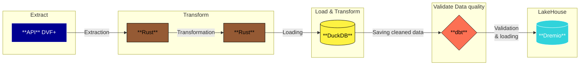

```mermaid
flowchart LR
    A[**API** DVF+] -->|Extraction| B[**Rust**]
    B -->|Transformation| C[**Rust**]
    C -->|Loading| D[(**DuckDB**)]
    D -->|Saving cleaned data| E{**dbt**}
    E -->|Validation<br>& loading| F[(**Dremio**)]

    subgraph Extraction [Extract]
        A
    end
    
    subgraph TransformationRust [Transform]
        B
        C
    end

    subgraph LT [Load & Transform]
        D
    end

    subgraph VD [Validate Data quality]
        E
    end
    
    subgraph DataWarehouse [LakeHouse]
        F
    end
    
    style A fill:#000091,stroke:#ffffff,color:#ffffff,stroke-width:1px
    style B fill:#955a34,stroke:#000000,color:#000000,stroke-width:1px
    style C fill:#955a34,stroke:#000000,color:#000000,stroke-width:1px
    style D fill:#fef242,stroke:#000000,color:#000000,stroke-width:1px
    style E fill:#fc7053,stroke:#000000,color:#000000,stroke-width:1px
    style F fill:#31d3db,stroke:#ffffff,color:#ffffff,stroke-width:1px
```
