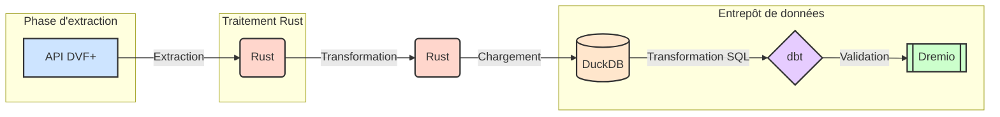

```mermaid
flowchart LR
    A[API DVF+] -->|Extraction| B(Rust)
    B -->|Transformation| C(Rust)
    C -->|Chargement| D[(DuckDB)]
    D -->|Transformation SQL| E{dbt}
    E -->|Validation| F[[Dremio]]

    subgraph Extraction [Phase d'extraction]
        A
    end
    
    subgraph TransformationRust [Traitement Rust]
        B
    end
    
    subgraph DataWarehouse [Entrepôt de données]
        D
        E
        F
    end
    
    style A fill:#cde4ff,stroke:#333,stroke-width:2px
    style B fill:#ffd6cc,stroke:#333,stroke-width:2px
    style C fill:#ffd6cc,stroke:#333,stroke-width:2px
    style D fill:#ffe6cc,stroke:#333,stroke-width:2px
    style E fill:#e6ccff,stroke:#333,stroke-width:2px
    style F fill:#ccffcc,stroke:#333,stroke-width:2px
```
